---
header-includes:
 - \usepackage{fvextra}
 - \DefineVerbatimEnvironment{Highlighting}{Verbatim}{breaklines,commandchars=\\\{\}}
 - \usepackage{fontspec}
 - \usepackage{setspace}
title: Data Engineering with Apache Spark
author: Markus Dale, medale@asymmetrik.com
date: May 2019
---

# Intro, Slides And Code
* Slides: https://github.com/medale/prez-spark-dataengineering/blob/master/presentation/SparkDataEngineering.pdf
* Spark Data Engineering Code Examples: https://github.com/medale/prez-spark-dataengineering

# Data Science Mission

\Large
* ID malicious GitHub Pull Requests?
* Source: https://www.gharchive.org/

# Data Engineering Mission
* https://www.gharchive.org/
     * 2/12/2011-12/31/2014 Timeline API (now deprecated).
     * From 1/1/2015 to now Events API.
     * Since 2015: About 20-40MB/hour * 37900 hours ~1TB 
* Store: Fast, time-based access when specifying yyyy, mm, dd, hh (or prefix combination)
* Side effect: Learn more about Spark batch processing
     
# Data engineering 

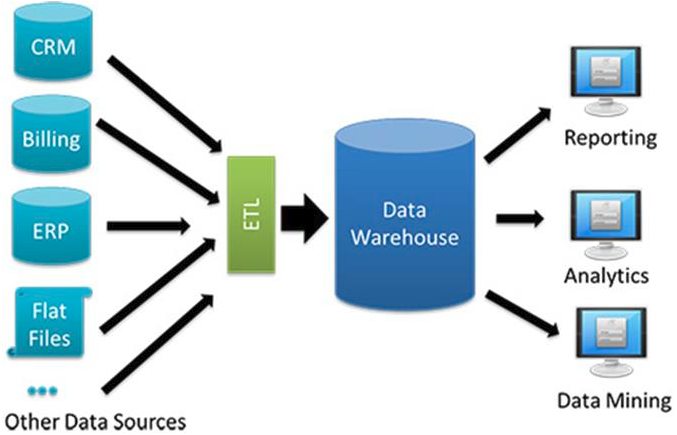

# Apache Spark - Big data tooling


# Apache Spark: Data engineering on small dataset


# Apache Spark: Data engineering for larger dataset (Vertical Scaling)

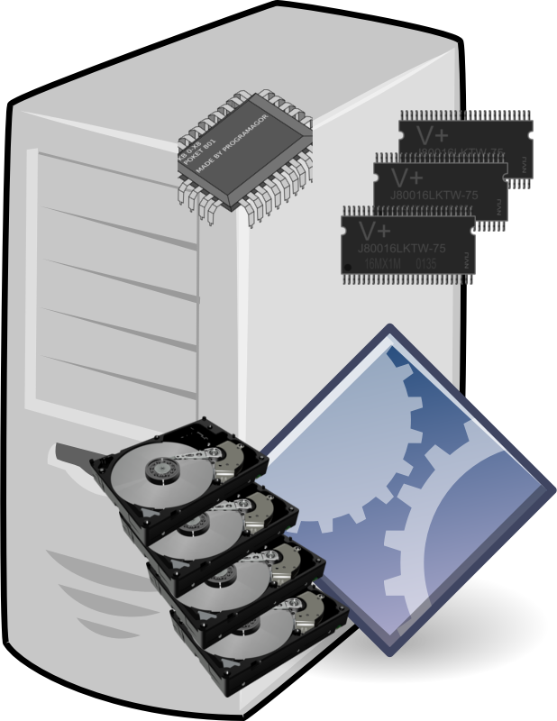{height=80%}

# Apache Spark: Data engineering for large datasets (Horizontal Scaling)

{height=80%}

# Cluster Manager - Manage cores, memory, special capabilities

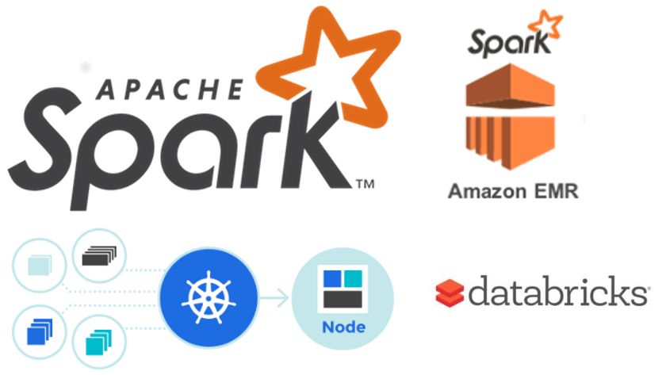

# Anatomy of a Spark Application

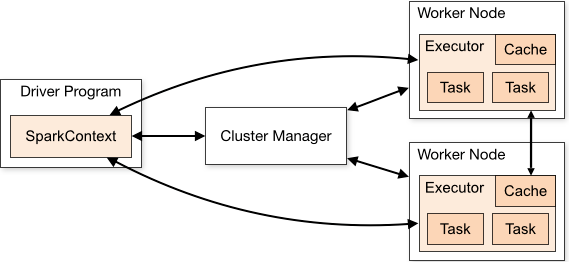
\tiny Source: Apache Spark website  
     
# Hello, Spark World!

\scriptsize
```scala
import org.apache.spark.sql.SparkSession

object HelloSparkWorld {

  val RecordsUrl = "file:///datasets/github/data"

  def process(spark: SparkSession): (Long,Long) = {
    val records = spark.read.json(RecordsUrl)
    val totalEventCount = records.count()
    val prs = records.where(records("type") === "PullRequestEvent")
    val pullRequestEventCount = prs.count()
    (totalEventCount, pullRequestEventCount)
  }

  def main(args: Array[String]): Unit = {
    val spark = SparkSession.builder().appName("HelloSparkWorld").getOrCreate()
    val (total, prs) = process(spark)
    println(s"Total events: ${total}, pr events: ${prs}.")
    spark.stop()
  }
}
```

# SparkSession - Gateway to the Cluster

\Large
```scala
def main(args: Array[String]): Unit = {

    val spark = SparkSession.builder().
        appName("HelloSparkWorld").
        getOrCreate()
    ...
    spark.stop()
```

# API - SparkSession Object

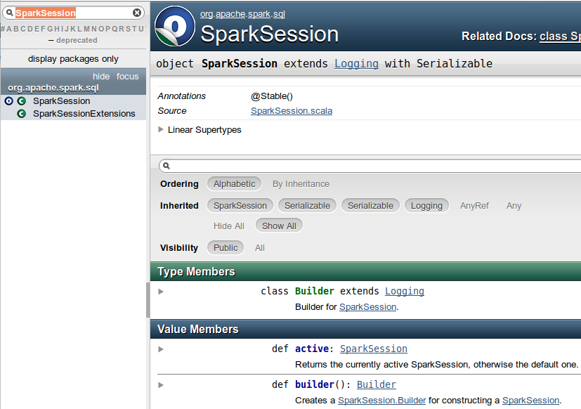

# API - SparkSession Class 

```scala
//spark.read - DataFrameReader
val records: DataFrame = spark.read.json(RecordsUrl)
```

# spark.read: DataFrameReader - Input
\Large
* csv
* json
* jdbc
* parquet
* text - DataFrame with "value" column
* textFile - Dataset\[String\]
* Third party: 
     * https://spark-packages.org: Avro, Redshift, MongoDB...
     * Spark Cassandra Connector (DataStax github)

# DataFrame = Dataset\[Row\]

\large
```scala
val records: DataFrame = spark.read.json(RecordsUrl)
```

# DataFrame Schema

\scriptsize
```scala
scala> records.printSchema
root
 |-- actor: struct (nullable = true)
 |    |-- display_login: string (nullable = true)
 |    |-- id: long (nullable = true)
   ...
 |-- created_at: string (nullable = true)
 |-- id: string (nullable = true)
 |-- payload: struct (nullable = true)
 |    |-- comment: struct (nullable = true)
 |    |    |-- body: string (nullable = true)    
   ...
 |-- public: boolean (nullable = true)
 |-- repo: struct (nullable = true)
 |    |-- id: long (nullable = true)
 |    |-- url: string (nullable = true)
 |-- type: string (nullable = true)
```

# GitHub Event Data

```bash
cd /datasets/github/data
wget http://data.gharchive.org/2019-04-28-0.json.gz
wget http://data.gharchive.org/2019-04-28-1.json.gz
wget http://data.gharchive.org/2019-04-28-13.json.gz
```

# Preliminary Exploration

```bash
# creates 2019-04-28-0.json
gunzip 2019-04-28-0.json.gz

# 95865
wc -l 2019-04-28-0.json
```

# Editor: one JSON per line

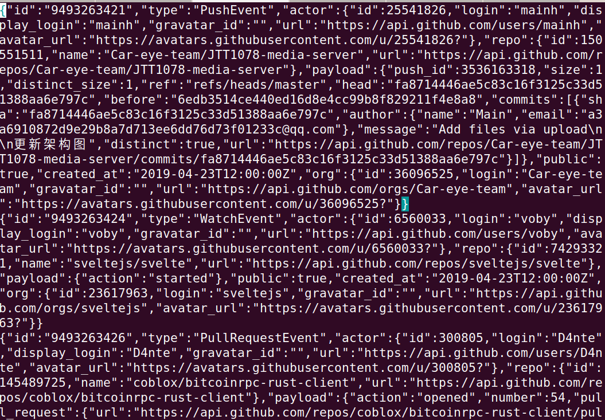

# Pretty Print One Record?

```bash

# default 1000 lines - xaa, xab...
split 2019-04-28-0.json
mkdir temp
cd temp

# 1 file per line
split -1 ../xaa

# xac's a PullRequestEvent
python -m json.tool < xac > pretty.json
```

# Open pretty.json in Atom - PullRequestEvent 

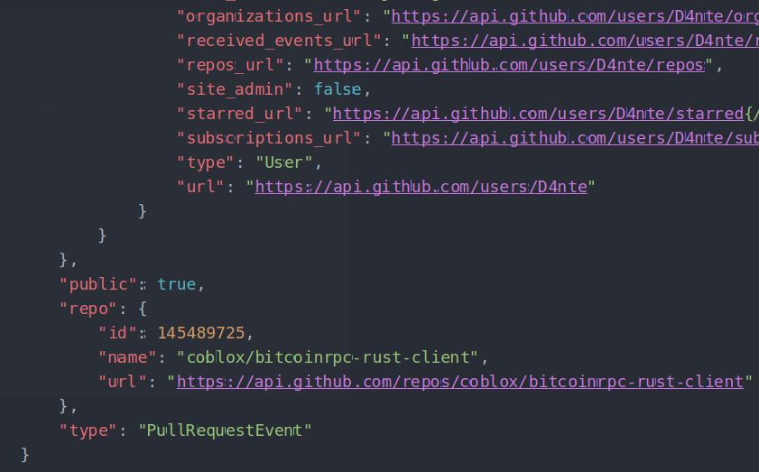

# Starting Spark Standalone Cluster Manager

\small
```bash
# Start on master
$SPARK_HOME/sbin/start-master.sh --host 192.168.1.232

# Start one or more workers
$SPARK_HOME/sbin/start-slave.sh spark://192.168.1.232:7077
```

# Spark Standalone Cluster Manager UI - idle

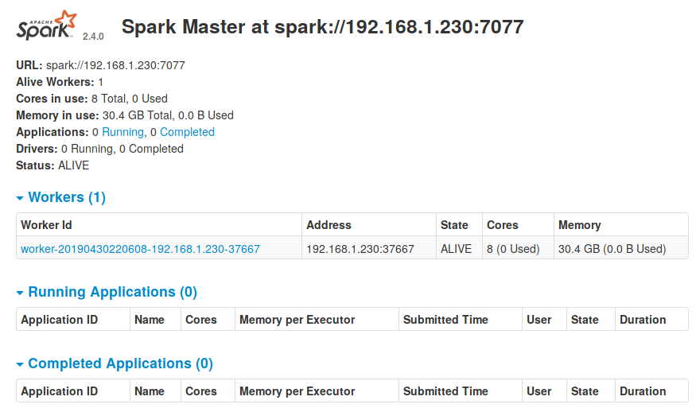

# Running spark-shell in cluster

```bash
spark-shell --master spark://192.168.1.232:7077 \
 --driver-memory 1g \
 --executor-memory 2g \
 --total-executor-cores 4 \
 --executor-cores 2 \
 --jars /tmp/dataset-0.9.0-SNAPSHOT-fat.jar
```

# Spark Shell Startup


# Spark Standalone Cluster Manager - 1 running application

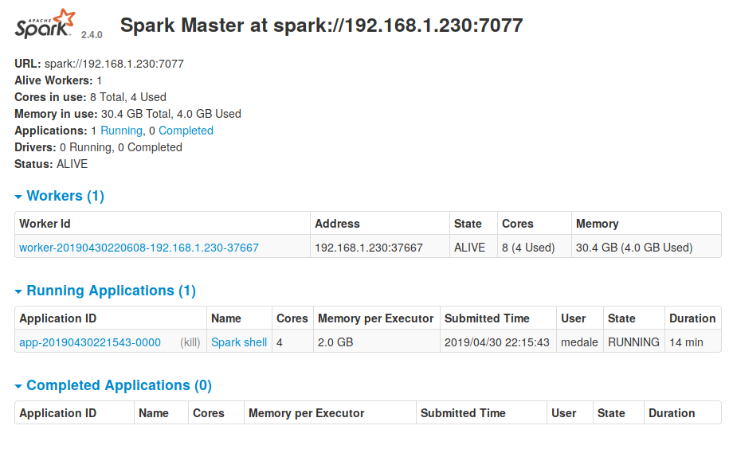

# spark-shell auto-imports

\large
```scala
scala> :imports
 1) import org.apache.spark.SparkContext._
 2) import spark.implicits._       
 3) import spark.sql               
 4) import org.apache.spark.sql.functions._ 

```

# Data Exploration - schema and counting

```scala
val RecordsUrl = "file:///datasets/github/data"
val records = spark.read.json(RecordsUrl)
records.printSchema
//...
// |-- repo: struct (nullable = true)
// |    |-- id: long (nullable = true)
// |    |-- name: string (nullable = true)
// |    |-- url: string (nullable = true)
// |-- type: string (nullable = true)

records.count()
//147,374
```

# Spark Application UI - Jobs, stages, tasks

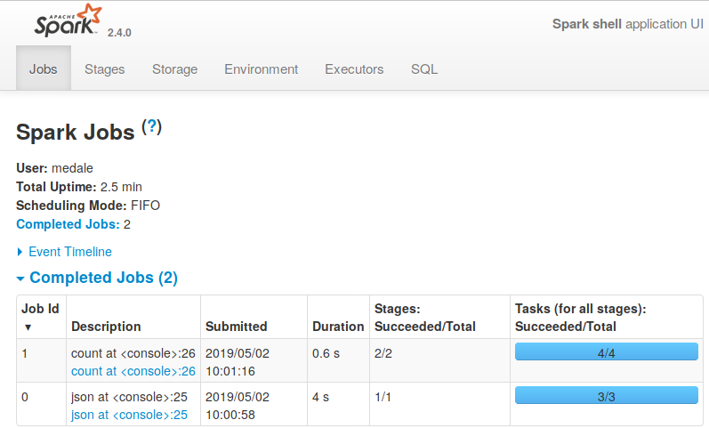

# Spark Application UI - Stages

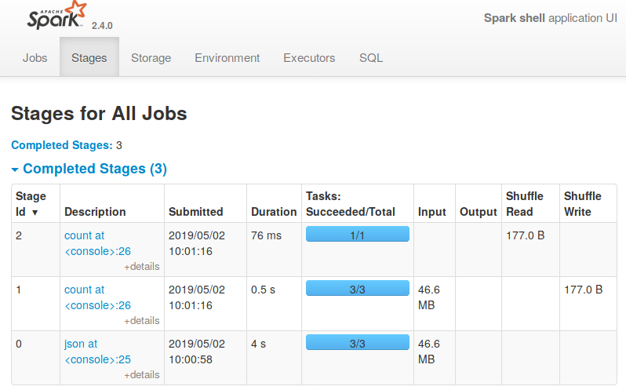

# Spark Application UI - Stage details

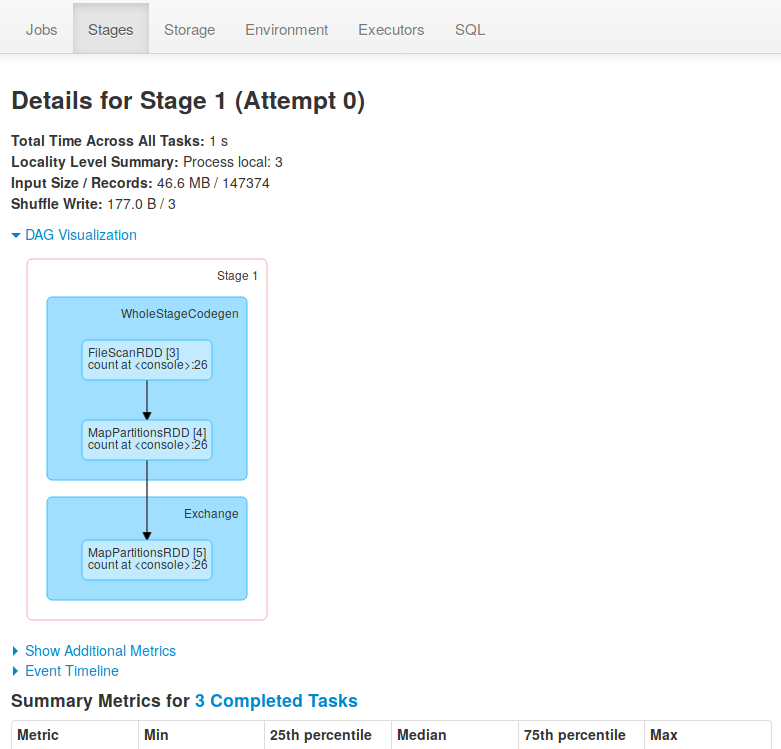{height=80%}

# Job 1 - Stages 1 and 2 DAG

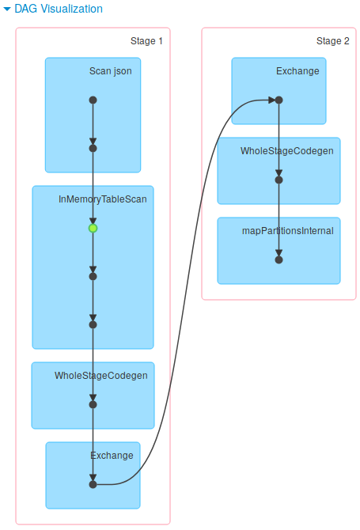{height=95%}

# One Job = n lazy transformations, 1 action

\scriptsize
```scala
//job0 (read twice - once for schema, once for count)
val records = spark.read.json(RecordsUrl)
//lazy transformation
records.cache()
//action 1 - end of job 1
records.count()
records.printSchema

//2 lazy transformations - immutable datasets
val types = records.select("type")
val distinctTypes = types.distinct()

//one eager action - job 2
distinctTypes.show()
+--------------------+                                                          
|                type|
+--------------------+
|           PushEvent|
...
|    PullRequestEvent|
+--------------------+
```

# Spark Application UI - Storage (caching)

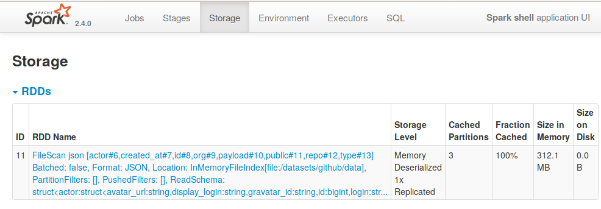

# Default file system/file system URLs

```scala
val hc = spark.sparkContext.hadoopConfiguration
hc.get("fs.defaultFS")
//res4: String = file:///

spark.read.json("/datasets/github/data")
spark.read.json("file:///datasets/github/data")

//hdfs://<name-node>:port
//s3a://<bucket-name>

```

# Input partitions - splittable file?

* Splittable: bzip2, parquet, avro
* Non-splittable: gzip (1 task per file)

```scala
hc.get("dfs.block.size")
//res6: String = 134217728
```

# Resilient Distributed Datasets (RDDs)


# RDDs - Not deprecated!

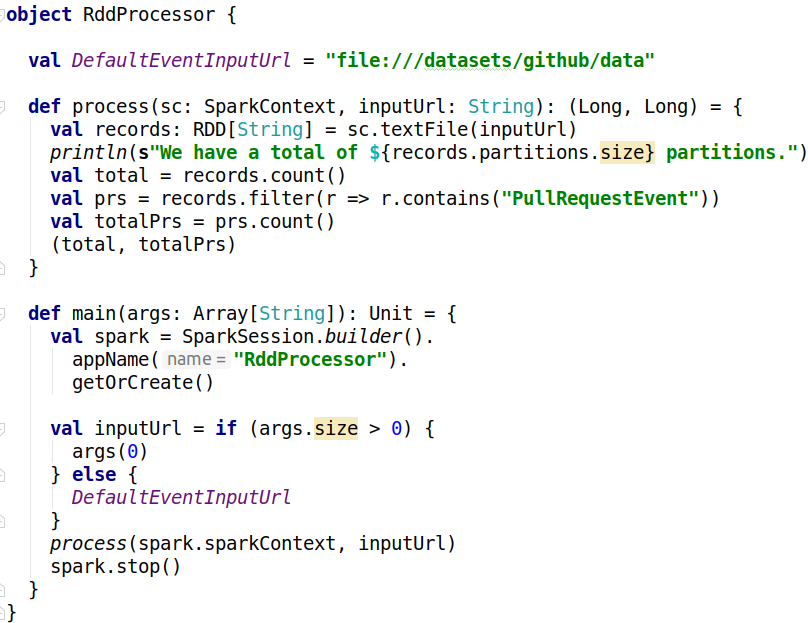

# Datasets/DataFrames compiled to RDDs
* Catalyst query optimizer for built-in functions
* Project Tungsten - memory management
     * Row storage (Apache Arrow)
     * Encoders for Dataset objects (spark.implicits._)

# Data Exploration - event type distribution
\scriptsize
```scala

val prs = records.where(records("type") === "PullRequestEvent")
val pullRequestEventCount = prs.count()

import spark.implicits._
val typeCounts = records.groupBy($"type").
   count.orderBy($"count".desc)
typeCounts.show
+--------------------+-----+                                                    
|                type|count|
+--------------------+-----+
|           PushEvent|82518|
|         CreateEvent|18313|
|          WatchEvent|16868|
|    PullRequestEvent| 6699|
...   
```
# Narrow vs. wide transformations
* narrow: all data from one partition
* wide: data from multiple parent partitions (shuffle)

# Shuffle Partitions - Default

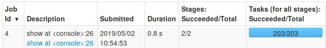

# Setting Shuffle Partitions

\Large
```scala
spark.conf.set("spark.sql.shuffle.partitions", "10")
```
# Shuffle Partitions Optimized

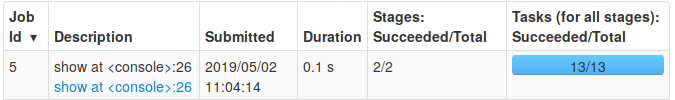

# API - Some Dataset Transformations
* select
* where
* distinct
* limit
* orderBy
* join

# API - Some Dataset Actions
* collect
* count
* take(n)
* head
* write - DataFrameWriter

# DataFrameWriter
* csv
* jdbc
* parquet
* text

# Just the PullRequestEvents and their schema

```scala
val texts = spark.read.text(RecordsUrl)
val prsText = texts.where($"value".contains("PullRequestEvent"))

val reparteds = prsText.repartition(2)
reparteds.write.text("file:///datasets/github/prs")
```

# Writing partitions - Output directory (57MB/file)

```bash
ls
_SUCCESS
part-00000-9f85464d-c4e8-4b55-9d95-580acb3f30cd-c000.txt
part-00001-9f85464d-c4e8-4b55-9d95-580acb3f30cd-c000.txt
```

# API - Column
* +, -, *, %
* ===, =!=, >, <, ...
* asc, desc
* startsWith, contains, endsWith, like, rlike
* isNull, isNaN, isIn

# API - functions
* array functions, explode
* date/time functions
* math, string

# Date Exploration

\scriptsize
```scala 
val prs = spark.read.json("file:///datasets/github/prs")
//prs: org.apache.spark.sql.DataFrame = [actor: struct<avatar_url: string, 
//display_login: string ... 4 more fields>, created_at: string

prs.select("created_at").take(10)
//res15: Array[org.apache.spark.sql.Row] = 
//Array([2019-04-28T01:37:47Z], 
//[2019-04-28T01:30:24Z], [2019-04-28T01:23:30Z],...
```

# Adding year, month, day, hour columns

\small
```scala
val ymdhPrs = prs.withColumn("year", year($"created_at")).
     withColumn("month", month($"created_at")).
     withColumn("day", dayofmonth($"created_at")).
     withColumn("hour", hour($"created_at"))

ymdhPrs.printSchema
...
 |-- type: string (nullable = true)
 |-- year: integer (nullable = true)
 |-- month: integer (nullable = true)
 |-- day: integer (nullable = true)
 |-- hour: integer (nullable = true)
```

# Saving to Parquet with partitioning columns

\scriptsize
```scala
ymdhPrs.write.partitionBy("year","month","day","hour").
     parquet("file:///datasets/github/prs-ymdh")
     
/datasets/github/prs-ymdh/year=2019/month=4/day=28/hour=9
part-00000-afd2a04d-bdeb-48fe-9e43-12dc4fb3535a.c000.snappy.parquet
part-00001-afd2a04d-bdeb-48fe-9e43-12dc4fb3535a.c000.snappy.parquet
part-00002-afd2a04d-bdeb-48fe-9e43-12dc4fb3535a.c000.snappy.parquet

/datasets/github/prs-ymdh/year=2019/month=4/day=28/hour=20
part-00001-afd2a04d-bdeb-48fe-9e43-12dc4fb3535a.c000.snappy.parquet
part-00002-afd2a04d-bdeb-48fe-9e43-12dc4fb3535a.c000.snappy.parquet
part-00003-afd2a04d-bdeb-48fe-9e43-12dc4fb3535a.c000.snappy.parquet

/datasets/github/prs-ymdh/year=2019/month=4/day=28/hour=21
part-00000-afd2a04d-bdeb-48fe-9e43-12dc4fb3535a.c000.snappy.parquet
part-00003-afd2a04d-bdeb-48fe-9e43-12dc4fb3535a.c000.snappy.parquet
```

# Reading from Parquet - schema and predicate pushdown

\small
```scala
val mprs = spark.read.parquet("file:///datasets/github/prs-ymdh")
val oneHour = mprs.where("year = 2019 AND month = 04 AND day = 28 AND hour = 21")
oneHour.explain(true)
...
== Optimized Logical Plan ==
Filter (((((((isnotnull(day#493) && isnotnull(year#491)) && isnotnull(month#492)) 
&& isnotnull(hour#494)) && (year#491 = 2019)) && (month#492 = 4)) && (day#493 = 28)) 
&& (hour#494 = 21))
+- Relation[actor#483,created_at#484,id#485,org#486,payload#487,public#488,repo#489,
type#490,year#491,month#492,day#493,hour#494] parquet
```


# And now for something completely different: Colon Cancer
* Screening saves lives! {width=100px}
     * Colonoscopy - talk to your doc
     * [Dave Barry: A journey into my colon — and yours](https://www.miamiherald.com/living/liv-columns-blogs/dave-barry/article1928847.html)
* [Colorectal Cancer Alliance](https://www.ccalliance.org/)

# Questions?

{width=200px}

* medale@asymmetrik.com
* https://github.com/medale/prez-spark-dataengineering/blob/master/presentation/SparkDataEngineering.pdf