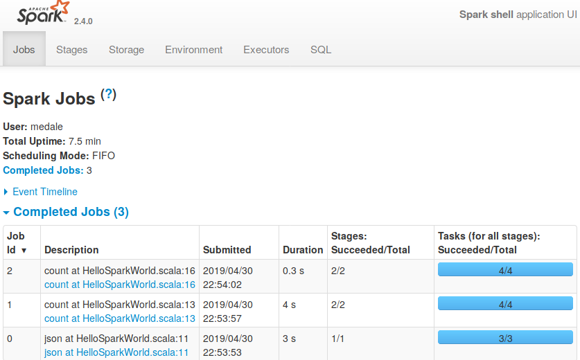
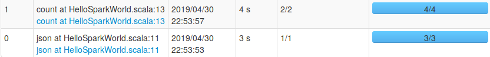
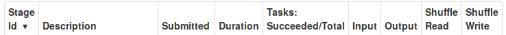
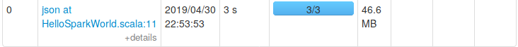
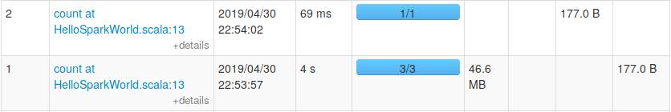

---
header-includes:
 - \usepackage{fvextra}
 - \DefineVerbatimEnvironment{Highlighting}{Verbatim}{breaklines,commandchars=\\\{\}}
 - \usepackage{fontspec}
 - \usepackage{setspace}
title: Data Engineering with Apache Spark
author: Markus Dale, medale@asymmetrik.com
date: May 2019
---

# Intro, Slides And Code
* Slides: https://github.com/medale/prez-spark-dataengineering/blob/master/presentation/SparkDataEngineering.pdf
* Scala Spark Code Examples: https://github.com/medale/prez-spark-dataengineering

# Goals
* Intro to Spark Scala Dataset API for data engineering
     * At scale data exploration
     * At scale ETL (Extract Transform Load)
     * Storage formats
     * Spark abstractions
     
# Data engineering 


# Apache Spark: Data engineering on small dataset


# Apache Spark: Data engineering for larger dataset (Vertical Scaling)

{height=80%}

# Data engineering for large datasets (Horizontal Scaling)

{height=80%}

# Cluster Manager


# Resilient Distributed Datasets (RDDs)


# Anatomy of a Spark Application


\tiny Source: Apache Spark website

# Hello, Spark World!


# Starting Spark Standalone Cluster Manager

\small
```bash
# Start on master
$SPARK_HOME/sbin/start-master.sh --host 192.168.1.232

# Start one or more workers
$SPARK_HOME/sbin/start-slave.sh spark://192.168.1.232:7077
```

# Spark Standalone Cluster Manager UI - idle


# Running spark-shell in cluster

```bash
spark-shell --master spark://192.168.1.232:7077 \
 --driver-memory 1g \
 --executor-memory 2g \
 --total-executor-cores 4 \
 --executor-cores 2 \
 --jars /tmp/dataset-0.9.0-SNAPSHOT-fat.jar
```
# Spark Shell Startup


# Spark Standalone Cluster Manager - 1 running application


# HelloSparkWorld in spark-shell

```scala
scala> import com.uebercomputing.HelloSparkWorld
import com.uebercomputing.HelloSparkWorld

scala> HelloSparkWorld.process(spark)
res0: (Long, Long) = (147374,6699)
```

# Spark Application UI - Jobs, stages, tasks



# Job - n lazy transformations, 1 action

\small
```scala
//job 0 - list files, infer schema
val records = spark.read.json("file:///datasets/github/data")
//transformation
records.cache()
//action - job 1
val totalEventCount = records.count()

//transformation - datasets are immutable!
val prs = records.where(records("type") === "PullRequestEvent")
//action - job 2    
val pullRequestEventCount = prs.count()
```

# Job 0 - Stages, tasks, partitions

{height=50%}
{height=50%}

# Job 0 - Stage 0, tasks, partitions

{height=50%}
{height=50%}

# Input partitions - splittable file?


# Job 1 - count

{height=50%}
{height=50%}

# Job 1 - count Stages 1 and 2

{height=50%}
{height=50%}

# Job 1 - Stages 1 and 2 DAG

{height=95%}

# RDDs - Not deprecated!


# And now for something completely different: Colon Cancer
* Screening saves lives! {width=100px}
     * Colonoscopy - talk to your doc
     * [Dave Barry: A journey into my colon — and yours](https://www.miamiherald.com/living/liv-columns-blogs/dave-barry/article1928847.html)
* [Colorectal Cancer Alliance](https://www.ccalliance.org/)

# Questions?

{width=200px}

* medale@asymmetrik.com
* https://github.com/medale/prez-spark-dataengineering/blob/master/presentation/SparkDataEngineering.pdf