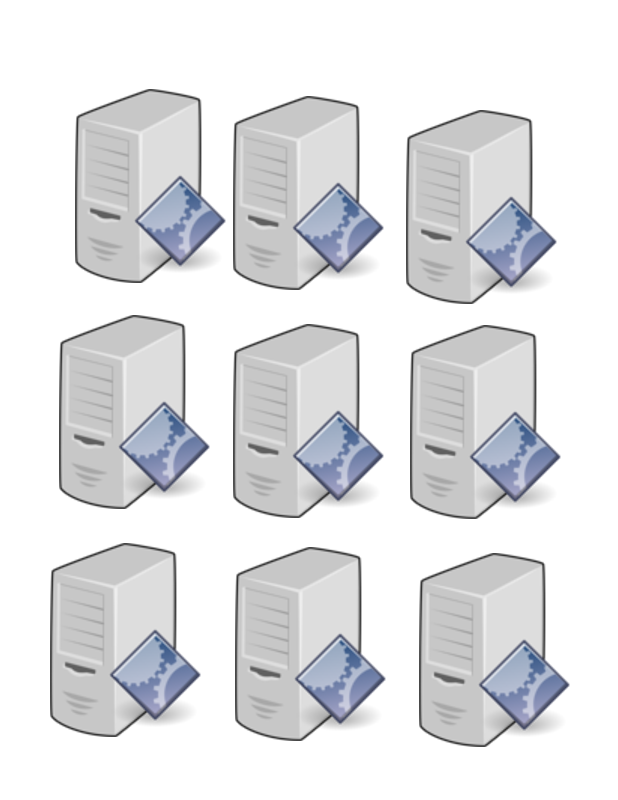

---
header-includes:
 - \usepackage{fvextra}
 - \DefineVerbatimEnvironment{Highlighting}{Verbatim}{breaklines,commandchars=\\\{\}}
 - \usepackage{fontspec}
 - \usepackage{setspace}
title: Data Engineering with Apache Spark
author: Markus Dale, medale@asymmetrik.com
date: May 2019
---

# Intro, Slides And Code
* Slides: https://github.com/medale/
* Scala Spark Code Examples: https://github.com/medale/

# Data engineering on small dataset

# Data engineering for larger dataset (Vertical Scaling)

{height=80%}

# Data engineering for large datasets (Horizontal Scaling)

# Layers of Spark
* TODO: distributed resource management
* Spark Standalone
* Kubernetes
* Hadoop YARN
* Mesos
* Spark application: Driver, executors
* tasks, partitions (distributed file system, commonly accessible data store)

# Cluster Manager, Driver, Executors, Tasks

\tiny Source: Apache Spark website

# And now for something completely different: Colon Cancer
* Screening saves lives! {width=100px}
     * Colonoscopy - talk to your doc
     * [Dave Barry: A journey into my colon — and yours](https://www.miamiherald.com/living/liv-columns-blogs/dave-barry/article1928847.html)
* [Colorectal Cancer Alliance](https://www.ccalliance.org/)

# Questions?

{width=200px}

* medale@asymmetrik.com
* [Infrequent blog/past presentations http://uebercomputing.com/](http://uebercomputing.com/)
