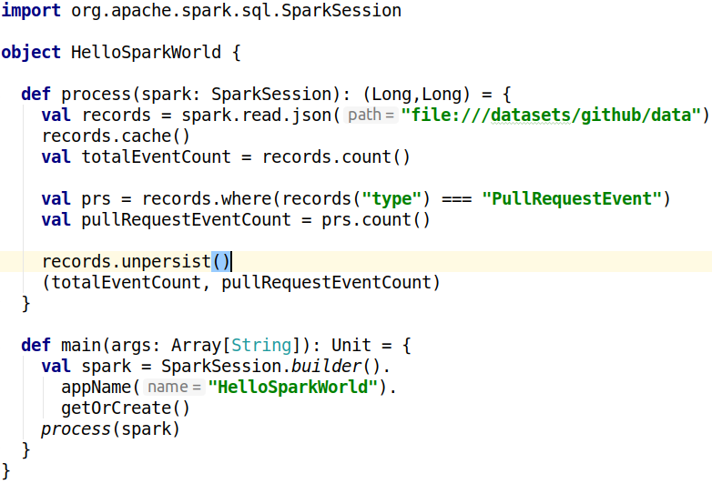

---
header-includes:
 - \usepackage{fvextra}
 - \DefineVerbatimEnvironment{Highlighting}{Verbatim}{breaklines,commandchars=\\\{\}}
 - \usepackage{fontspec}
 - \usepackage{setspace}
title: Data Engineering with Apache Spark
author: Markus Dale, medale@asymmetrik.com
date: May 2019
---

# Intro, Slides And Code
* Slides: https://github.com/medale/
* Scala Spark Code Examples: https://github.com/medale/

# Data engineering 


# Data engineering on small dataset


# Data engineering for larger dataset (Vertical Scaling)

{height=80%}

# Data engineering for large datasets (Horizontal Scaling)


# Cluster Manager


# Resilient Distributed Datasets (RDDs)


# Anatomy of a Spark Application


\tiny Source: Apache Spark website

# Hello, Spark World!



# Starting Spark Standalone Cluster Manager

\small
```bash
# Start on master
$SPARK_HOME/sbin/start-master.sh --host 192.168.1.230

# Start one or more workers
$SPARK_HOME/sbin/start-slave.sh spark://192.168.1.230:7077
```

# Spark Standalone Cluster Manager UI - idle


# Running spark-shell in cluster

```bash
spark-shell --master spark://192.168.1.230:7077 \
 --driver-memory 1g \
 --executor-memory 2g \
 --total-executor-cores 4 \
 --executor-cores 2 \
 --jars /tmp/dataset-0.9.0-SNAPSHOT-fat.jar
```

# Spark Standalone Cluster Manager - 1 running application


# RDDs - Not deprecated!


# And now for something completely different: Colon Cancer
* Screening saves lives! {width=100px}
     * Colonoscopy - talk to your doc
     * [Dave Barry: A journey into my colon — and yours](https://www.miamiherald.com/living/liv-columns-blogs/dave-barry/article1928847.html)
* [Colorectal Cancer Alliance](https://www.ccalliance.org/)

# Questions?

{width=200px}

* medale@asymmetrik.com
* [Infrequent blog/past presentations http://uebercomputing.com/](http://uebercomputing.com/)
