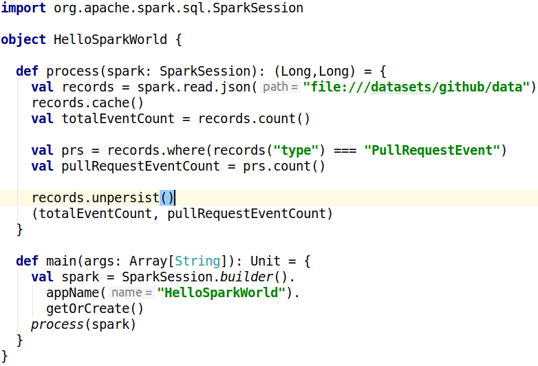

% Speaker Notes: Data Engineering with Apache Spark
% Markus Dale, medale@asymmetrik.com
% May 2019

# Setup
* Open Spark API: https://spark.apache.org/docs/latest/api/scala/index.html

# Intro, Slides And Code
* Bio:
     * mostly Java, big data with Hadoop
     * big data with Spark, Databricks, Scala
     * Now Asymmetrik - Scala, Spark, Elasticsearch, Akka...
     * Data Engineer
* Slides: https://github.com/medale/prez-spark-dataengineering/blob/master/presentation/SparkDataEngineering.pdf
* Scala Spark Code Examples: https://github.com/medale/prez-spark-dataengineering
* Also https://github.com/medale/spark-mail

# Data Science Mission - ID malicious GitHub Pull Requests?
* https://www.gharchive.org/

# Data Engineering Mission
* https://www.gharchive.org/
* Old API/Events API (we won't deal with old API)
* Events API - PullRequestEvent

# Data Engineering

* [dataquest.io: "transform data into a useful format for analysis"](https://www.dataquest.io/blog/what-is-a-data-engineer/)

# Apache Spark - Big data tooling
* Shell for exploration at scale
* Dataset batch API - many supported input sources/formats
     * builds on Hadoop and other 3rd party libraries
* Streaming API
* ML library
* Graph library

# Apache Spark: Data engineering on small dataset
* Take subset of data
* Figure out structure, approaches

# Apache Spark: Data engineering for larger dataset (Vertical Scaling)
* Server-grade machine - more cores 
* More memory, more data

# Apache Spark: Data engineering for large datasets (Horizontal Scaling)
* Cluster manager manages resources
* Spark manages Spark application (driver, executors)
     * Sunny day
     * Error handling (machine dies, slows, network...)

# Cluster Manager - Manage cores, memory, special capabilities
* Spark local mode (not a cluster manager)
* Spark Standalone
* Kubernetes, Mesos
* Spark on Hadoop YARN
* In cloud: Spark on AWS EMR, Google, Azure, Databricks 
* Schedule resources

# Anatomy of a Spark Application
* One cluster manager - multiple Spark applications
* Per Spark application
   * 1 driver
   * n executors (cache memory, task slots)



# Hello, Spark World!
* spark session 
* spark.read (DataFrameReader) - json (.gz, 1 json per line)
* lazy transformation - read to get schema
* count - action - execute a job
* Datasets, DataFrame and RDD are immutable
* contain lineage (how did we get to this dataset?)
* where - transformation

# SparkSession - Gateway to the Cluster
* builder static method - Builder
* appName
* config
* master
* getOrCreate()

# API - SparkSession Object
* spark.apache.org - Documentation - API Docs
* Object ("static" methods) vs. class

# API - SparkSession Class
* read - DataFrameReader input
* createDataFrame/createDataset
* emptyDataFrame/emptyDataset
* spark.implicits._ ($ and Scala object encoder)
* udf
* stop

# API - DataFrameReader
* csv
* json
* parquet
* text - DataFrame - column "value"
* textFile - Dataset\[String\]
* schema - specify read schema

# DataFrame = Dataset\[Row\]
* sql package object - `type DataFrame = Dataset[Row]`
* DataFrame has a schema

# DataFrame Schema
* printSchema
* .schema ()

# GitHub Data
* subset to local drive
* for production - need distributed storage system
     * S3
     * Hadoop HDFS

# Preliminary Exploration
* What does on JSON look like pretty printed?


# Starting Spark Standalone Cluster Manager
* start master to explicit host (default port 7077)
* one or more workers to spark://...:


# Driver - Executors
* Driver: deploy-mode client or cluster, memory
* Executors
     * how many total?
     * how many parallel tasks per executor (cores)
     * memory

# Code executing on driver vs. executor

# Running spark-shell in cluster

--deploy-mode (default client)

# Job - Stages, tasks, partitions
* each stage - all transformations that can be done without shuffle (narrow transformations)
* wide transformation - shuffle (data in a partition was created from many other partitions)

# Default file system/file system URLs

# Narrow vs. wide transformations
https://jaceklaskowski.gitbooks.io/mastering-apache-spark/spark-rdd-transformations.html

# Splittable data formats

# Shuffle partitions

# Schemas 
* inferred 
* read/write schema

# Parquet
* data partitioning

# Memory pressure - partitions, executors, shuffle partitions

# Serialization code

# Airflow - Spark workflows

# S3
sc.hadoopConfiguration.set("fs.s3a.secret.key",
sc.hadoopConfiguration.set("fs.s3a.access.key",

https://www.gharchive.org/
wget http://data.gharchive.org/2019-04-28-0.json.gz
wget http://data.gharchive.org/2019-04-28-1.json.gz
wget http://data.gharchive.org/2019-04-28-13.json.gz

store under data directory
run spark-shell from parent of data directory
(gz of .json file with one json per line)

```scala
val records = spark.read.json("data")
//slow - needs to figure out JSON schema
records.cache
records.count
//235728

//huge
records.printSchema

records.select("type").distinct.show
+--------------------+                                                          
|                type|
+--------------------+
|           PushEvent|
|         GollumEvent|
|        ReleaseEvent|
|  CommitCommentEvent|
|         CreateEvent|
|PullRequestReview...|
|   IssueCommentEvent|
|         DeleteEvent|
|         IssuesEvent|
|           ForkEvent|
|         PublicEvent|
|         MemberEvent|
|          WatchEvent|
|    PullRequestEvent|
+--------------------+
records.groupBy("type").count.show(numRows=100, truncate=false)
+-----------------------------+------+                                          
|type                         |count |
+-----------------------------+------+
|PushEvent                    |119478|
|GollumEvent                  |1126  |
|ReleaseEvent                 |999   |
|CommitCommentEvent           |417   |
|CreateEvent                  |32198 |
|PullRequestReviewCommentEvent|4811  |
|IssueCommentEvent            |14749 |
|DeleteEvent                  |8585  |
|IssuesEvent                  |7783  |
|ForkEvent                    |7466  |
|PublicEvent                  |624   |
|MemberEvent                  |970   |
|WatchEvent                   |22337 |
|PullRequestEvent             |14185 |
+-----------------------------+------+


val texts = spark.read.text("data")
//fast - no schema
//texts: org.apache.spark.sql.DataFrame = [value: string]

val prsText = texts.where($"value".contains("PullRequestEvent"))
prsText.count
prsText.rdd.partitions.size
prsText.write.text("prs")

//prs directory with
//part-00000-ea8360a9-79f0-494b-a4ca-c7e05c1c7104-c000.txt  _SUCCESS
//part-00001-ea8360a9-79f0-494b-a4ca-c7e05c1c7104-c000.txt

val prs = spark.read.json("prs")
prs.printSchema

prs.groupBy("payload.action").count.show()
+--------+-----+                                                                
|  action|count|
+--------+-----+
|reopened|   82|
|  closed| 6926|
|  opened| 7177|
+--------+-----+

val schemaStr = prs.schema.treeString
import java.nio.file._
import java.nio.charset._

Files.write(Paths.get("prs.schema"), schemaStr.getBytes(StandardCharsets.UTF_8))

.describe method
```
